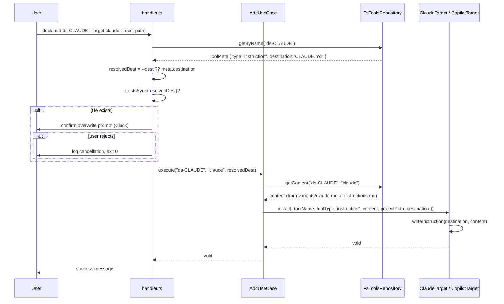

# CLI-001 — Soporte para instrucciones instalables

## Problem statement

The `duck` CLI supports installing agents, tools, hooks, and skills, but has no concept of project-level instruction files (e.g., `CLAUDE.md` for Claude Code or `.github/copilot-instructions.md` for GitHub Copilot). Users cannot distribute and install reusable AI instruction files through `duck add`, leaving instruction management entirely manual. The feature introduces `instruction` as a first-class component type, with a `destination` field in `meta.json`, per-target variant resolution, a `--dest` flag override on `duck add`, and interactive overwrite confirmation.

## Alternatives

| Alternative | Description | Decision |
|---|---|---|
| Option A: New dedicated `duck install-instruction` command | Introduce a separate CLI command (`duck install-instruction`) that handles only `instruction` type components, keeping the `add` command unchanged. | Not chosen — violates the explicit out-of-scope constraint ("Nuevo comando CLI dedicado a instrucciones") and duplicates arg-parsing and prompt logic already in the `add` command. |
| Option B: Destination resolution inside target adapters | Keep `AddUseCase` unchanged; push destination logic into `ClaudeTarget` and `CopilotTarget`, which derive the path from `toolType` and the new `destination` field passed via `InstallOptions`. | Not chosen — target adapters are AI-tool adapters, not business-logic holders; embedding destination resolution and overwrite-confirmation in adapters violates the hexagonal pattern and makes the overwrite prompt impossible to inject/test independently. |
| Option C: Destination-aware `AddUseCase` with adapter contract extension | Extend `ToolMeta` with the `destination` field, thread it through `InstallOptions`, extend `ITargetAdapter.install` to accept a resolved destination, handle `--dest` flag and overwrite confirmation in the `handler`, and update both target adapters to write to the resolved destination for `instruction` type. | **Chosen** — keeps all business logic in the use case, all I/O (file-existence check and Clack prompt) in the handler, and each adapter's responsibility narrowly scoped to writing the file at the destination it receives. Satisfies all R-IDs while respecting the hexagonal architecture and technical constraints. |

## Chosen solution

**Destination-aware `AddUseCase` with adapter contract extension**

This solution threads the resolved installation destination through the existing call chain without introducing new abstractions. The `handler` resolves the final destination (applying `--dest` > `meta.json` `destination` precedence per R012), checks for file existence, and asks the user to confirm overwrite via a Clack `confirm` prompt (NF001). The `AddUseCase.execute` receives an optional `dest` override and passes a fully-resolved `destination` in `InstallOptions` to the adapter. Target adapters write to the provided destination for `instruction` type components, selecting the correct variant (R008, R009, R010). The `ToolMeta` interface gains the optional `destination` field (R002), and its absence for `instruction` type is validated in `FsToolsRepository.getContent` (NF002 / EC002). The new `tools/duck-spec/instructions/ds-CLAUDE/` component and the `duck-spec` kit update satisfy R011.

## Technical design

### Data model changes

`ToolMeta` (in `IToolsRepository.ts`) gains one optional field:

```ts
export interface ToolMeta {
  name: string;
  type: "agent" | "hook" | "skill" | "mcp-server" | "kit" | "instruction"; // R001
  description: string;
  tags: string[];
  targets: string[];
  path: string;
  components?: string[];   // kit only
  destination?: string;    // instruction only — default install path relative to user project root (R002)
}
```

`InstallOptions` (in `ITargetAdapter.ts`) gains a `destination` field so target adapters know where to write:

```ts
export interface InstallOptions {
  toolName: string;
  toolType: string;
  content: string;
  projectPath: string;
  destination?: string;    // resolved absolute destination path for instruction type
}
```

### Destination resolution (R004, R012)

Precedence evaluated in `handler.ts` before calling `useCase.execute`:

```
resolvedDest = options.dest ?? tool.destination ?? undefined
```

`options.dest` is the CLI `--dest <path>` flag value (R004). `tool.destination` is the `meta.json` field value. The resulting `resolvedDest` (if set) is passed to `useCase.execute` as an optional parameter.

### Overwrite confirmation flow (R005, R006, R007, EC001, EC004)

In `handler.ts`, after `toolMeta` is retrieved and before calling `useCase.execute`:

1. If `toolMeta.type === "instruction"` and `resolvedDest` is defined:
   - Compute `absoluteDest = join(process.cwd(), resolvedDest)`.
   - If `existsSync(absoluteDest)`, call Clack `confirm({ message: "… already exists. Overwrite?" })`.
   - If the user cancels or answers `false`, log a cancellation notice (EC004) and exit without calling the use case.
2. If the user confirms (or the file does not yet exist), call `useCase.execute(toolName, targetName, resolvedDest)`.

### `AddUseCase` changes (R004, R012)

`execute` receives an optional third argument `dest?: string` and forwards it to `adapter.install` via `InstallOptions.destination`.

```ts
async execute(toolName: string, targetName: string, dest?: string): Promise<void>
```

For `kit` type, recursive calls to `this.execute` do not forward `dest` (kit components use their own `meta.json` destinations).

### Variant resolution (R003, R008, R009, R010)

No change to `FsToolsRepository.getContent` — the existing variant resolution (`variants/<target>.md` → fallback `instructions.md`) already satisfies R003 and R010 for any component type (EC003).

### Validation (NF002, EC002)

In `FsToolsRepository.getContent`, before resolving content, if `meta.type === "instruction"` and `meta.destination` is absent, throw:

```
Error: Component "<name>" of type "instruction" is missing the required "destination" field in meta.json.
```

### Target adapter changes

**`ClaudeTarget.install`** — add an `instruction` branch:

```ts
} else if (toolType === "instruction") {
  if (!options.destination) throw new Error("destination is required for instruction type");
  await this.writeInstruction(options.destination, content);
}
```

`writeInstruction` writes the file at the absolute path. The caller (handler) has already handled overwrite confirmation, so the adapter always writes unconditionally.

**`CopilotTarget.install`** — same pattern, same `instruction` branch.

### New tool component: `ds-CLAUDE` instruction

```
tools/duck-spec/instructions/ds-CLAUDE/
├── meta.json
├── instructions.md       (fallback)
└── variants/
    └── claude.md         (Claude Code variant)
```

`meta.json`:
```json
{
  "name": "ds-CLAUDE",
  "type": "instruction",
  "description": "Project-level CLAUDE.md instructions for the duck-spec workflow",
  "tags": ["duck-spec", "instructions", "claude"],
  "targets": ["claude"],
  "destination": "CLAUDE.md"
}
```

`duck-spec` kit `meta.json` gains `"ds-CLAUDE"` in its `components` array (R011).

### Call sequence



## Files

| Path | Action | Description |
|---|---|---|
| `packages/cli/src/shared/interfaces/IToolsRepository.ts` | MODIFY | Add `"instruction"` to the `type` union and add optional `destination` field to `ToolMeta` |
| `packages/cli/src/shared/interfaces/ITargetAdapter.ts` | MODIFY | Add optional `destination` field to `InstallOptions` |
| `packages/cli/src/shared/repositories/FsToolsRepository.ts` | MODIFY | Add validation that `instruction` components have a `destination` field in `getContent` |
| `packages/cli/src/commands/add/add.useCase.ts` | MODIFY | Accept optional `dest` parameter in `execute` and forward it to `InstallOptions.destination` |
| `packages/cli/src/commands/add/handler.ts` | MODIFY | Add `--dest` option; resolve destination; perform file-existence check and Clack overwrite confirmation for `instruction` type |
| `packages/cli/src/infrastructure/targets/ClaudeTarget.ts` | MODIFY | Add `instruction` branch in `install` that writes content to the provided destination path |
| `packages/cli/src/infrastructure/targets/CopilotTarget.ts` | MODIFY | Add `instruction` branch in `install` that writes content to the provided destination path |
| `tools/duck-spec/instructions/ds-CLAUDE/meta.json` | CREATE | `meta.json` for the `ds-CLAUDE` instruction component |
| `tools/duck-spec/instructions/ds-CLAUDE/instructions.md` | CREATE | Fallback content for the `ds-CLAUDE` instruction (generic duck-spec CLAUDE.md) |
| `tools/duck-spec/instructions/ds-CLAUDE/variants/claude.md` | CREATE | Claude Code variant content for the `ds-CLAUDE` instruction |
| `tools/duck-spec/meta.json` | MODIFY | Add `"ds-CLAUDE"` to the `components` array of the duck-spec kit |

## Requirement coverage

| ID | Design decision |
|---|---|
| R001 | `ToolMeta.type` union extended with `"instruction"` in `IToolsRepository.ts` |
| R002 | Optional `destination` field added to `ToolMeta` in `IToolsRepository.ts`; read during destination resolution in `handler.ts` |
| R003 | `FsToolsRepository.getContent` variant resolution (`variants/<target>.md` → `instructions.md`) already applies to all types including `instruction`; no change needed |
| R004 | `--dest <path>` option added to `handler.ts`; value passed as `dest` to `useCase.execute` |
| R005 | In `handler.ts`, after meta retrieval and before `useCase.execute`, `existsSync(absoluteDest)` triggers a Clack `confirm` prompt for `instruction` type |
| R006 | When the user confirms the Clack prompt, `useCase.execute` is called and the adapter writes the file unconditionally |
| R007 | When the user rejects the Clack prompt, `handler.ts` logs a cancellation message and exits without calling `useCase.execute` |
| R008 | `ClaudeTarget.install` gains an `instruction` branch that writes to `options.destination`; variant resolution selects `variants/claude.md` when present |
| R009 | `CopilotTarget.install` gains an `instruction` branch that writes to `options.destination`; variant resolution selects `variants/copilot.md` when present |
| R010 | `FsToolsRepository.getContent` falls back to `instructions.md` when no matching variant file exists (existing behavior, covers EC003) |
| R011 | New component directory `tools/duck-spec/instructions/ds-CLAUDE/` with `meta.json`, `instructions.md`, `variants/claude.md`; `"ds-CLAUDE"` added to `duck-spec` kit `components` |
| R012 | Destination precedence `--dest` > `meta.json` `destination` evaluated explicitly in `handler.ts` before calling `useCase.execute` |
| NF001 | Overwrite confirmation implemented with Clack `confirm` prompt inside `handler.ts` |
| NF002 | `FsToolsRepository.getContent` validates presence of `destination` for `instruction` type and throws a descriptive error when absent (covers EC002) |
