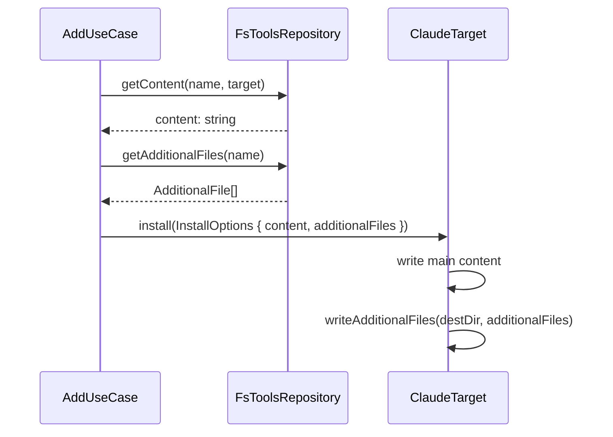

# CLI-002 — Soporte para archivos adicionales instalables en componentes

## Problem statement

The `duck add` installation pipeline is built around a single `content: string`. `FsToolsRepository.getContent()` reads one file and the target adapter writes it to one destination. Components such as the `ds-analysis` and `ds-design` skills ship template files alongside their main `instructions.md` that are silently ignored by `duck add`, producing incomplete installations. The fix is to let any component declare additional files in `meta.json` and have the CLI read and install them alongside the main content.

## Alternatives

| Alternative | Description | Decision |
|---|---|---|
| Option A — Extend `getContent` to return a bundle | Change `IToolsRepository.getContent` to return `{ content: string; additionalFiles: AdditionalFile[] }` directly, requiring a single call to get everything. | Not chosen — breaks the existing `getContent` contract that many callers (including kit recursion) rely on for a plain `string`; requires a larger refactor surface than necessary. |
| Option B — New `getAdditionalFiles` method on `IToolsRepository` | Add a separate `getAdditionalFiles(name, target)` method to `IToolsRepository` and call it from the use case after `getContent`. | Not chosen — requires two repository calls from the use case and makes error-on-missing-file handling more awkward; the use case would need to orchestrate the check itself rather than delegating it to the repository. |
| Option C — New `getAdditionalFiles` method on `IToolsRepository`, called inside the use case alongside `getContent` | Add `getAdditionalFiles(name: string): Promise<AdditionalFile[]>` to `IToolsRepository` / `IAddToolsRepository`, read and validate the files in `FsToolsRepository`, carry the result through `InstallOptions`, and write each file in `ClaudeTarget`. | **Chosen** — minimal contract surface change; clear separation of concerns; the repository owns all I/O and error detection; the use case only wires options; the adapter only writes; fully respects the no-cross-layer-import constraint. |

## Chosen solution

**Separate `getAdditionalFiles` method propagated through `InstallOptions`**

`IToolsRepository` gains a new method `getAdditionalFiles(name: string): Promise<AdditionalFile[]>`. `FsToolsRepository` implements it by reading the `"files"` array from `meta.json`, loading each file relative to the component directory, and throwing a descriptive error if any file is missing. The `AddUseCase` calls this method after `getContent` and includes the result in `InstallOptions` as `additionalFiles`. `ClaudeTarget.install` iterates over `additionalFiles` and writes each one into the same destination directory as the main content for the types that support it (`agent`, `skill`, `instruction`, `hook`, `mcp-server`). Finally, the `meta.json` files of the `ds-analysis` and `ds-design` skill components are updated to declare their template files via the new `"files"` field.

This satisfies R001 (meta.json `"files"` field), R002 (repository exposes additional files), R003 (interfaces carry the list), R004 (ClaudeTarget writes them), R005 (ds-analysis and ds-design meta.json updated), and R006 (abort with descriptive error on missing file). It respects the technical constraint that the use case never imports concrete repositories or infrastructure, and keeps all file I/O inside the repository and adapter layers.

## Technical design

### New shared type: `AdditionalFile`

```ts
// packages/cli/src/shared/interfaces/IToolsRepository.ts
export interface AdditionalFile {
  /** File name only (no path separators) — written as-is inside the destination directory. */
  fileName: string;
  /** Raw file content. */
  content: string;
}
```

### Extended `ToolMeta`

`ToolMeta` gains an optional `files?: string[]` field matching the `"files"` array in `meta.json`. Entries are paths relative to the component directory.

```ts
export interface ToolMeta {
  // ... existing fields ...
  files?: string[];
}
```

### Extended `IToolsRepository`

```ts
export interface IToolsRepository {
  listAll(): Promise<ToolMeta[]>;
  getByName(name: string): Promise<ToolMeta | null>;
  getContent(name: string, target: string): Promise<string>;
  getAdditionalFiles(name: string): Promise<AdditionalFile[]>;
}
```

`getAdditionalFiles` returns an empty array when `"files"` is absent or empty (EC001). If any declared file does not exist it throws:

```
Error: Component "<name>" declares additional file "<relPath>" which does not exist at "<absolutePath>".
```

satisfying R006 and NF001.

### Extended `InstallOptions`

```ts
// packages/cli/src/shared/interfaces/ITargetAdapter.ts
export interface InstallOptions {
  toolName: string;
  toolType: string;
  content: string;
  projectPath: string;
  destination?: string;
  additionalFiles: AdditionalFile[];   // NEW — always present, may be empty
}
```

### `IAddRepository.ts` re-export

`IAddRepository.ts` already re-exports `ITargetAdapter`, `InstallOptions`, and `IToolsRepository`. No structural change is needed beyond the updated types flowing through automatically.

### `AddUseCase.execute` changes

After obtaining `content`, the use case calls `this.repository.getAdditionalFiles(toolName)` and includes the result in `InstallOptions`:

```ts
const additionalFiles = await this.repository.getAdditionalFiles(toolName);
const options: InstallOptions = {
  toolName: tool.name,
  toolType: tool.type,
  content,
  projectPath: process.cwd(),
  destination: dest ?? tool.destination,
  additionalFiles,
};
```

### `FsToolsRepository.getAdditionalFiles` implementation

1. Resolve component directory via `this.toolsPath + meta.path`.
2. For each entry in `meta.files ?? []`, build the absolute path.
3. Attempt to `readFile`; if it throws with `ENOENT`, re-throw with the descriptive message (R006, NF001).
4. Return `AdditionalFile[]` with `fileName = path.basename(entry)` and `content = file contents`.

### `ClaudeTarget.install` changes

A new private method `writeAdditionalFiles(destDir: string, additionalFiles: AdditionalFile[])` writes each entry with `writeFile(join(destDir, file.fileName), file.content, "utf8")`, creating the directory if necessary. It is called from each `installAgent`, `installSkill`, and `writeInstruction` handler, and also from the `hook` and `mcp-server` branches using the `.claude` directory as destination (since those write into settings.json, additional files go into `.claude` root for those types — but because hooks and mcp-servers write JSON settings and have no natural "install directory" for files, additional files for those types are written to `.claude/`).

The destination directory per type:

| Type | Destination directory for additional files |
|---|---|
| `agent` | `.claude/agents/` |
| `skill` | `.claude/skills/<skillName>/` |
| `instruction` | `dirname(absoluteDestination)` |
| `hook` | `.claude/` |
| `mcp-server` | `.claude/` |

Existing files are overwritten without confirmation (EC003).

### `meta.json` updates for ds-analysis and ds-design

```jsonc
// tools/duck-spec/skills/ds-analysis/meta.json  (add "files" field)
{
  "files": ["analysis.template.md"]
}

// tools/duck-spec/skills/ds-design/meta.json  (add "files" field)
{
  "files": ["design.template.md", "tasks.template.md"]
}
```

### Data flow



## Files

| Path | Action | Description |
|---|---|---|
| `packages/cli/src/shared/interfaces/IToolsRepository.ts` | MODIFY | Add `AdditionalFile` interface, `files?: string[]` to `ToolMeta`, and `getAdditionalFiles` method to `IToolsRepository` |
| `packages/cli/src/shared/interfaces/ITargetAdapter.ts` | MODIFY | Add `additionalFiles: AdditionalFile[]` field to `InstallOptions`; import `AdditionalFile` from `IToolsRepository` |
| `packages/cli/src/shared/repositories/FsToolsRepository.ts` | MODIFY | Implement `getAdditionalFiles(name)`: read `meta.files`, load each file, throw descriptive error on missing file |
| `packages/cli/src/commands/add/add.useCase.ts` | MODIFY | Call `getAdditionalFiles` after `getContent` and include result in `InstallOptions` |
| `packages/cli/src/infrastructure/targets/ClaudeTarget.ts` | MODIFY | Add `writeAdditionalFiles` private method and call it from each component-type handler |
| `tools/duck-spec/skills/ds-analysis/meta.json` | MODIFY | Add `"files": ["analysis.template.md"]` |
| `tools/duck-spec/skills/ds-design/meta.json` | MODIFY | Add `"files": ["design.template.md", "tasks.template.md"]` |

## Requirement coverage

| ID | Design decision |
|---|---|
| R001 | `ToolMeta.files?: string[]` mirrors the optional `"files"` field in `meta.json`; `FsToolsRepository.listAll` parses it from JSON |
| R002 | `FsToolsRepository.getAdditionalFiles` reads each declared file from disk and returns `AdditionalFile[]` with name and content |
| R003 | `InstallOptions.additionalFiles: AdditionalFile[]` carries the list through the call from `AddUseCase` to the target adapter; `ITargetAdapter.install` receives it |
| R004 | `ClaudeTarget.writeAdditionalFiles` writes each `AdditionalFile` into the computed destination directory for all five component types |
| R005 | `tools/duck-spec/skills/ds-analysis/meta.json` and `tools/duck-spec/skills/ds-design/meta.json` updated with `"files"` arrays |
| R006 | `FsToolsRepository.getAdditionalFiles` throws a descriptive error identifying the component name and the missing file path when `readFile` fails with ENOENT |
| NF001 | The error thrown by `getAdditionalFiles` includes both the component `name` and the absolute missing-file path so the operator can diagnose it without further inspection |
